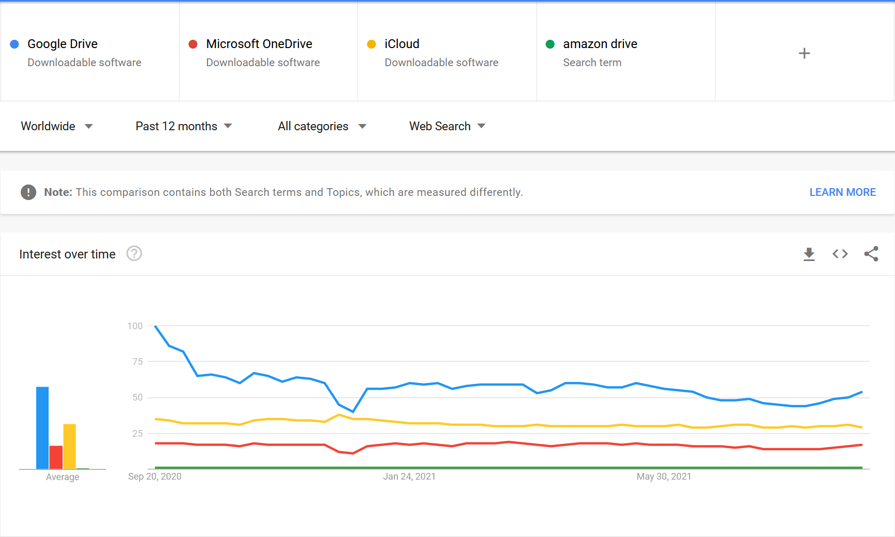

# Cloud Drives

Among others, these are big players:

- Google Drive
- Microsoft OneDrive
- Apple iCloud
- Amazon Drive

The popularities are

There are several usage scenarios:

- Use cloud storage as extended storage, no sync needed. We may have a small drive locally.
- Use cloud storage as a backup. If we had a bad local drive, then it's a saver. If we want to rollback to previous version, we can do that too.

Google drive sets all local files as virtual, so we are good for the above 2 requirements.

encryption on cloud:
https://cryptomator.org/
