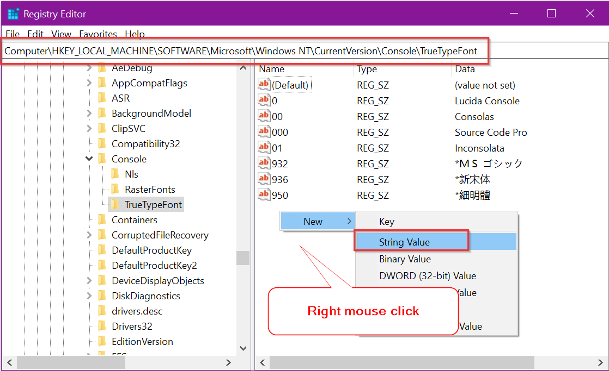

# Command Prompt Customization

## Fonts
Only certain mono type fonts can work with terminals.

To change fonts, make sure they are registered 



The registered fonts should appear in defaults menu for opened/new command windows.
If the fonts do not show in the properties menu, we need to do the following from
the post: https://superuser.com/questions/269818/change-default-code-page-of-windows-console-to-utf-8.
i.e., change the default code page.


### Temporary Fix in Command window

Run the following in a command window:
```chcp 65001```
Then the fonts should appear in defaults.

### Registry Fix
Changing registry is always dangerous, but here are the steps:
1. launch ```regedit``` from a command window.
2. Go to ```HKEY_LOCAL_MACHINE\Software\Microsoft\Command Processor\Autorun```. If 
   ```Autorun``` is not there, create it with New String(right mouse click the area).
3. Change the value to ```@chcp 65001>nul```.
