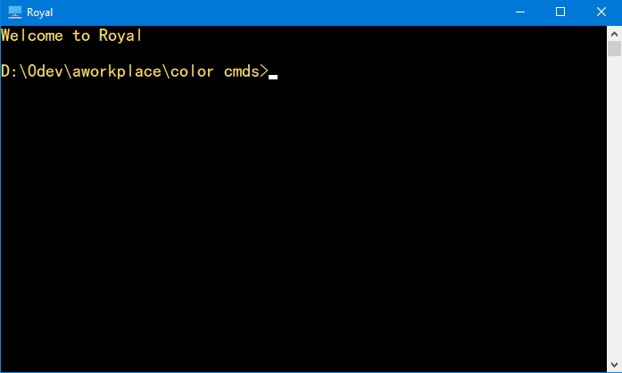
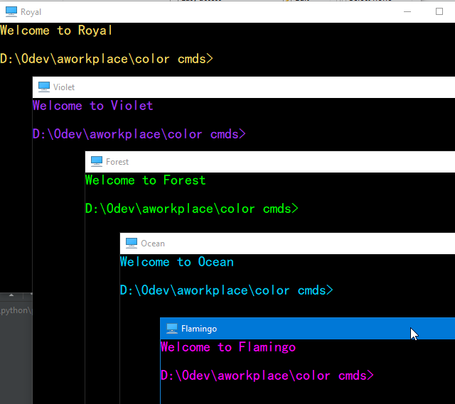
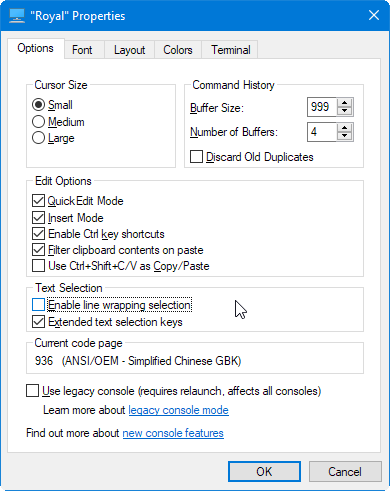
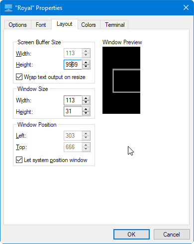
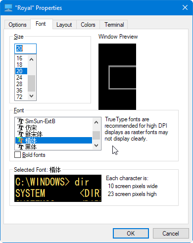

# Command Prompt Customization

## Fonts
Only certain mono type fonts can work with terminals.

To change fonts, make sure they are registered 


The registered fonts should appear in defaults menu for opened/new command windows.
If the fonts do not show in the properties menu, we need to do the following from
the post: https://superuser.com/questions/269818/change-default-code-page-of-windows-console-to-utf-8.
i.e., change the default code page.


### Temporary Fix in Command window

Run the following in a command window:
```chcp 65001```
Then the fonts should appear in defaults.

### Registry Fix
Changing registry is always dangerous, but here are the steps:
1. launch ```regedit``` from a command window.
2. Go to ```HKEY_LOCAL_MACHINE\Software\Microsoft\Command Processor\Autorun```. If 
   ```Autorun``` is not there, create it with New String(right mouse click the area).
3. Change the value to ```@chcp 65001>nul```.


Now create a royal.bat somewhere with the following content
```
@echo off
cmd /k echo Welcome to Royal
@echo on
```
Then right mouse click and select "Create shortcut". Right mouse click on the
shortcut, in the color tab we can set the royal RGB. Here is the result:



In order to pin this to the Windows 10 menu, copy this shortcut to 
%AppData%\Microsoft\Windows\Start Menu\Programs
which is <user home>\AppData\Roaming\Microsoft\Windows\Start Menu\Programs.
User home is usually C:\Users\<login id>

They show up like this:



Besides colors, we set the following as well. 

Set buffer size to 999 so we have more history.



Set Screen buffer size to 9999, set the window size 120 X 40.



Set font size to 20.



### Links
- https://www.howtogeek.com/673729/heres-why-the-new-windows-10-terminal-is-amazing
