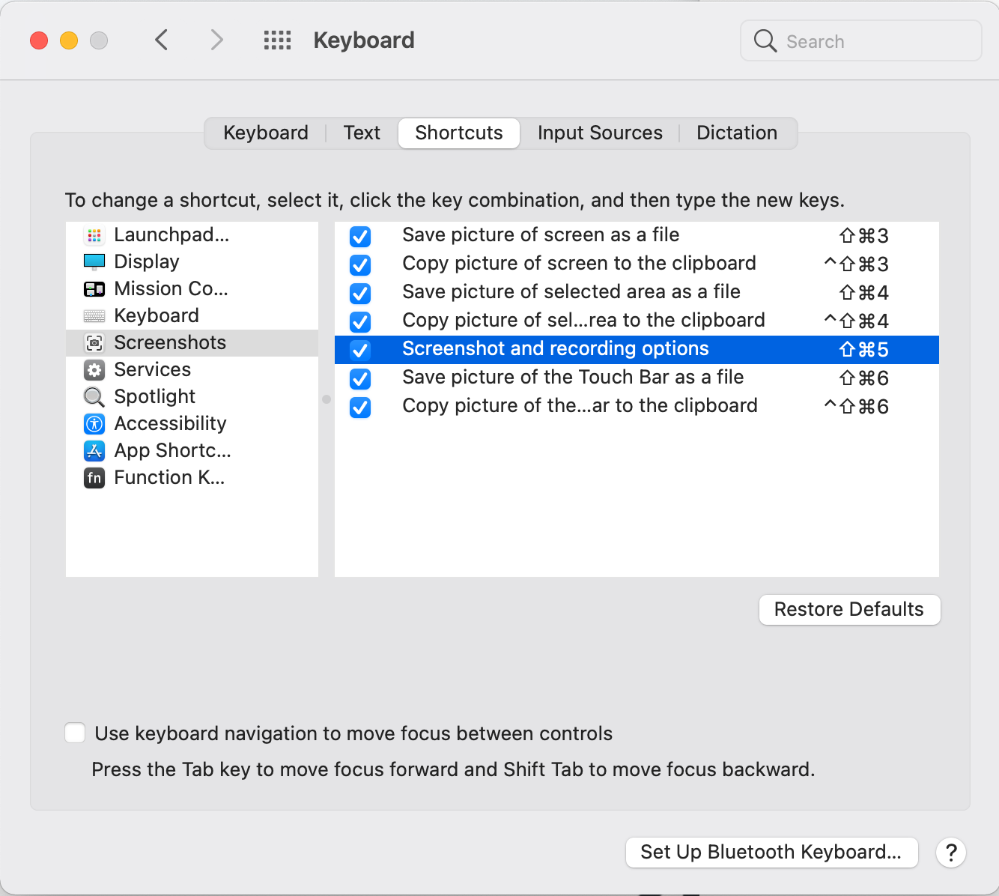

# Useful MacOS Commands and Tune ups

## Useful Commands

Ctrl + up arrow - shows virtual desktop on the top. Click the + sign on the 
upper right corner to add new virtual desktop.

Ctrl + Tab - shows running apps.

Ctrl + +/- for window zoom in/out.

Ctrl + Ctrl for dictation (Windows Ctrl = Mac Func)

Alt + Esc for speech(speak the highlighted text)

```Apple Icon Menu | About This Mac | System Report | Hardware``` to show hardware.

https://www.techradar.com/how-to/how-to-take-a-screenshot-on-a-mac

https://www.freecodecamp.org/news/jazz-up-your-zsh-terminal-in-seven-steps-a-visual-guide-e81a8fd59a38/

## Network Commands

https://www.makeuseof.com/how-to-use-terminal-as-network-utility-replacement/

netstat -a
netstat -I  en0
netstat -p tcp

ping apple.com
ping 192.168.1.1 -c 10

nslookup apple.com # resolve IP
nslookup 17.253.144.10 # resolve domain

traceroute apple.com

whois apple.com # resolve registration

finger <user>

nc -vz 192.168.1.1 80
nc -vz 192.168.1.1 70-90

To set proxy in the terminal
export http_proxy=http://proxy.server.com:port

In addition, curl check .curlrc file:
proxy = yourproxy.com:port


## Useful Tune ups

To show disk space: disk space: Apple Icon | About this Mac, storage tab.

To show file path

When a finder window is active, go to menu View | Show path bar. This will show 
the folder path at the bottom of the finder window.

http://www.marinamele.com/2014/05/customize-colors-of-your-terminal-in-mac-os-x.html

To show which shell you are using: https://www.moncefbelyamani.com/which-shell-am-i-using-how-can-i-switch/
- echo $SHELL
- ps -o comm=$$
- echo $0


## Functional Keys

Go to Apple | System Preference | Keyboard



For PC keyboards:

F14/F15 for screen brightness
F13, not used, remap to screen capture (shift + Cmd + 4)

F12, not used, remap to screen capture (shift + Cmd + 5)

F11 Show desktop

F10, not used, remap to show notification center

Terminal Banners:
https://askubuntu.com/questions/1020692/terminal-splash-screen-with-weather-calendar-time-sysinfo

Terminal Path Opener: https://alexn.org/blog/2021/07/18/iterm-open-file-cmd-click-ide-semantic-history.html

https://www.makeuseof.com/alt-key-on-mac/

https://www.makeuseof.com/how-to-split-a-macos-user-account-in-two/
