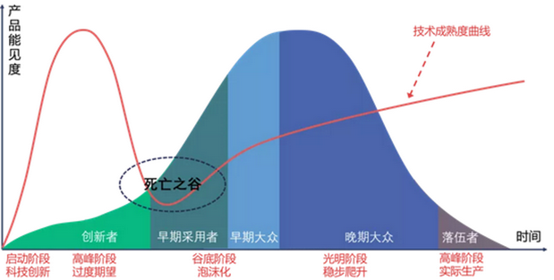

# Content

Maturity Curve

## Content classifications
- Learning
- Research
- Recommended/Deferred

## Programming
UI:
- JavaScript
    - Web: Vue
    - Desktop: ElectronJs
- Python Jupyter Book: MD, Latex, code
- SuperSet/Grafana: data
- PDF
    - Java iText
    - Python ReportLab
    - Latex
- Office Docs: Word, Excel, PPT
    - Apache Java POI
    - Python

UI Components
- Text: font, size, paragraphs
- Images
- Table
- Charts

## Languages

### Python

### JavaScript
Vue

### Latex

### Java

### Scala

## Mathematics

## Statistics
