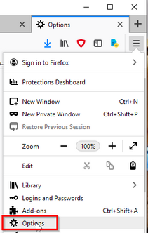
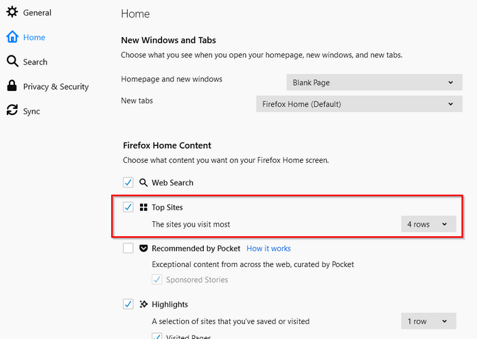
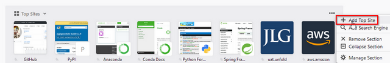
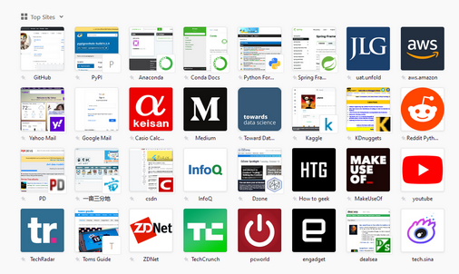

# Browser Customization

- Browsers: Chrome, FireFox, Opera  
  Turn on [topsites](browser/browser_setting.md) on browsers, so we have sites that we
  visit on a daily base. This is different from browser history.  
  Add markdown viewer extension to Chrome.

## User Data

To change Chrome's bookmark folder, add the following to the shortcut  
`--user-data-dir="G:\BrowserProfiles\ChromeStable"`

See:
- https://www.neowin.net/forum/topic/1237576-can-i-change-chromes-bookmarks-location/
- https://chromium.googlesource.com/chromium/src/+/HEAD/docs/user_data_dir.md

## FireFox
Go to "Open Menu" on the top right corner in FireFox and select Options.

On the left menu go to "Home", then check "Top Sites" and select "4 rows".
(We may turn off top sites if we uncheck this)

Now open a new browser tab("+" square at the top of the browser window).
For any visited site, click the dot menu on the top right to add it to the
top sites.

Notice that there is a pin icon next to the title at the bottom of each site.
Without this icon, the site will be washed out over time.

## Chrome

To turn off Chrome top sites, check [this](https://windowsreport.com/hide-most-visited-in-new-tab-page-google-chrome/)
