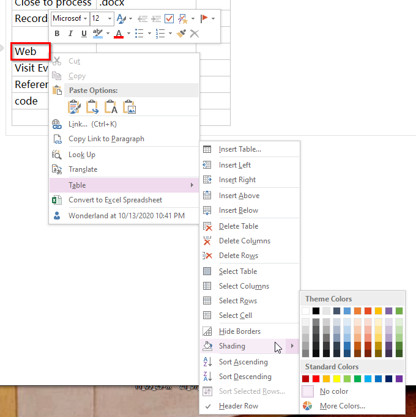

# MS OneNotes Tips

The new version is from: https://www.onenote.com/download.

To download desktop version of OneNote: http://www.onenote.com/download/win32/x64/en-us. 

This version has top tabs, while cloud versions don't, see
[here](https://support.microsoft.com/en-us/office/what-s-the-difference-between-the-onenote-versions-a624e692-b78b-4c09-b07f-46181958118f)

OneNote can't use custom fonts.

To change page color: 

To change table cell color:

