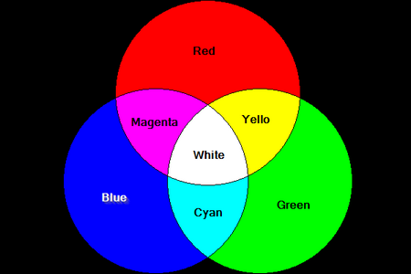
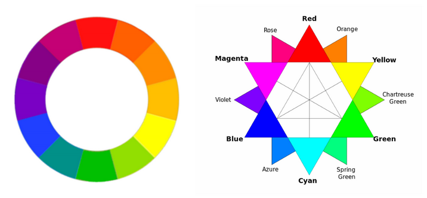

# Color Wheel

The following pictures are sourced from:
- https://drawpaintacademy.com/artists-color-wheel/
- https://www.invisionapp.com/inside-design/understanding-color-theory-the-color-wheel-and-finding-complementary-colors/
- http://changingminds.org/explanations/perception/visual/12-wheel.htm
- https://blog.asmartbear.com/color-wheels.html

8 colors with RGB, like 8-diagrams.

Here is the color wheel, more info [here](https://www.tigercolor.com/color-lab/color-theory/color-harmonies.htm)

We want to create color terminals.
Red and orange colors are kind of irritating, so we stay away from them.
We have 10 colors left on the wheel once we discard red and orange.
To make distinctions among colors, we choose the following colors:
- yellow
- green
- blue
- pink

Since we use them as font colors in command window/terminals, they should be
bright against black backgrounds.

[This site](https://graf1x.com/category/color-shades/) provides several shades.
[Wiki Web Color](https://en.wikipedia.org/wiki/Web_colors) and
[HTML color codes and names](https://www.computerhope.com/htmcolor.htm#color-codes)
provides extra color spectrum.
[Colors HEX](https://www.w3schools.com/colors/colors_hexadecimal.asp) can be used
to check colors.

Search for best color for reading
- https://www.cs.cmu.edu/~jbigham/pubs/pdfs/2017/colors.pdf
