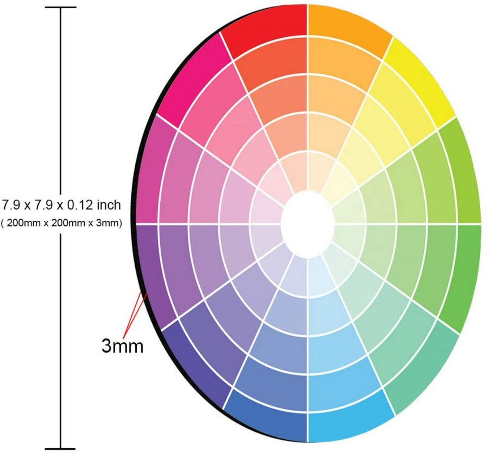

# Color compositions

These pictures are all from internet.

## RGB compositions

https://excelatfinance.com/xlf/xlf-colors-1.php

## More color compositions

We need 8-, 12- and 24- color compositions
- 8 colors: [rgb](rgb_combinations.png)
- 12 colors: [donut](../donut.png)
- 24 colors: [wheel](24-color_wheel.png)

Here is 13-color composition

Here is 29-color composition

## Shades

- 
- 
