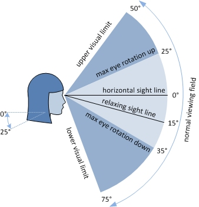
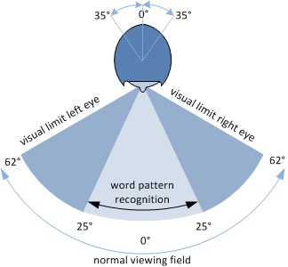
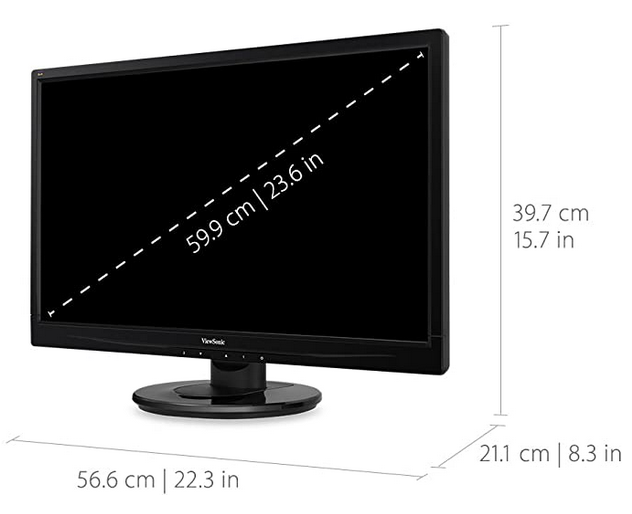
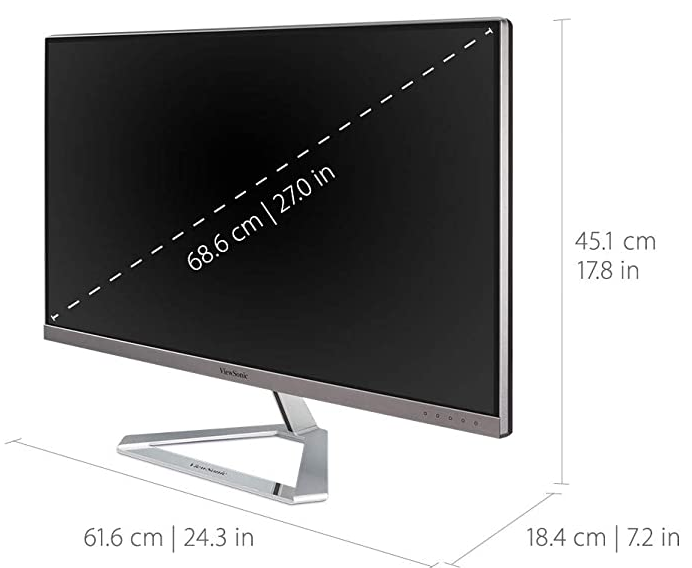
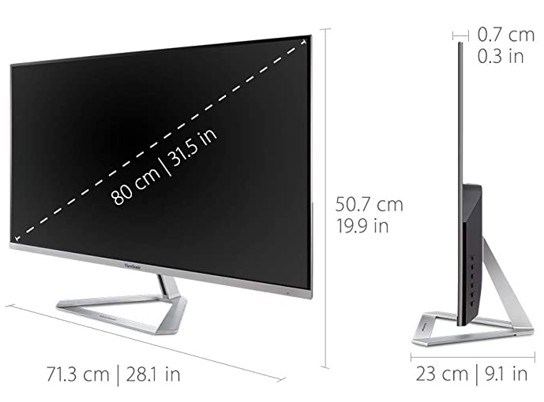
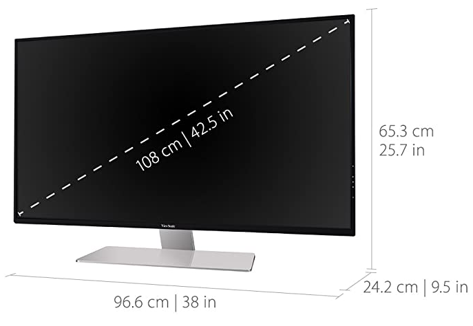
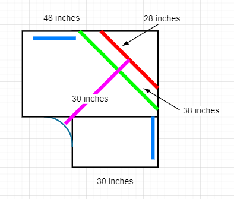
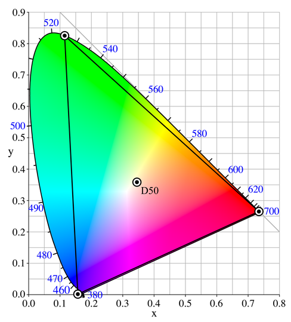

# Optimal Computer Monitor Size

We always want bigger screen size, but our vision is constraint. For example, 
[this post](https://pietvanderzanden.weblog.tudelft.nl/2014/05/) shows the
ranges in general. 

## Human Visual Range

The vertical range is between 15° below and 25° above the horizontal sight. 
So it's a 40° range.

The horizontal range is between about 60° to both left and right. So it's a
120° range.

Let's assume we sit 30-inches away from monitors, Then
- vertical: 30 * sin(20°) * 2 = 20.5
- horizontal: 30 * sin(60°) * 2 = 52

This is the comfort screen size if we sit still. 

I've seen other monitor layouts, such 2 X 2, 2 X 4 monitor layouts. However,
the outer monitors are more likely used for spot checking and not for constant
viewing. We may add auxiliary monitors as many as we want.

## Choose Monitors by Sizes

Now we need to make up the screen area 52 X 20.5 with monitors. Currently, 
these are the popular monitors:

| Monitor Size | Width       | Height      | Ratio Factor | 
|--------------|-------------|-------------|--------------| 
| 24 inches    | 20.9 inches | 11.8 inches | 1.3074       |
| 27 inches    | 23.5 inches | 13.2 inches | 1.4708       |
| 32 inches    | 27.9 inches | 15.7 inches | 1.7432       |
| 42 inches    | 36.6 inches | 20.6 inches | 2.2879       |

There are several options:
- 1 42-inch + 1 27-inch vertical(optinally + 1 27-inch vertical for symmetry 
  and use it as auxiliary): Since the height center is >= 10 inches, this works
  well for taller folks (maybe > 6 feet?)
- 1 32-inch + 2 24-inch vertical: The 32-inch is a little short vertically, but
  can work well since the height can handle legal paper height (14 inches).
- 1 32-inch + 2 27-inch vertical: The 2 27-inch monitors can handle more long
  content, such as programming code.

With 3 monitors, we may turn side monitors a little to accommodate the total 
width.

## Monitor Resolution

When working with multiple monitors, we want to keep the resolutions as close
as possible to avoid visual jumps.

| Monitor Size | Width       | Height      | Resolution   | DPI | Grouping |
|--------------|-------------|-------------|--------------|-----|----------| 
| 24 inches    | 20.9 inches | 11.8 inches | 1920 X 1080  |  92 | 2        |
| 27 inches    | 23.5 inches | 13.2 inches | 2560 X 1440  | 109 | 1        |
|              |             |             | 2048 X 1152  |  87 | 2        |
|              |             |             | 1920 X 1080  |  82 |          |
| 32 inches    | 27.9 inches | 15.7 inches | 3840 X 2160  | 138 |          |
|              |             |             | 2560 X 1440  |  92 | 2        |
|              |             |             | 2048 X 1152  |  73 |          |
| 42 inches    | 36.6 inches | 20.6 inches | 3840 X 2160  | 105 | 1        |
|              |             |             | 3200 X 1800  |  87 | 2        |
|              |             |             | 2880 X 1620  |  79 |          |
|              |             |             | 2560 X 1440  |  70 |          |

So seems that we have 2 possibilities, as indicated in the grouping column.
Option 2 is more comfort since the font size is larger, but it depends on 
individuals.

The above sizes are visible sizes. Count in frames, here are some samples from
ViewSonic sizes:

## Computer Desks

Another consideration is where we put these monitors. One solution is the 
corner desk.

The desk is 30 X 70 X 70 X 30. The minimal space is 48 X 30, for side monitors
and the distance between these monitors and viewers. The curved extra gives 
more room for keyboards and elbows. We might need more room for others, such
as notes, phones/pads, etc. 65 X 30 is comfort in general.

At the corner, the main monitor is about 25 - 30 inches away from users. Side
monitors are ~ 25 inches away(desk width is 30 inches).

[OfficeFurniture.com](https://www.officefurniture.com/8813030.aspx) has a long
desk 72 X 72 X 29.25. Price is $715

[Madison](https://www.madisonliquidators.com/new/modern-l-shaped-computer-desk-with-storage/2613/)
has a long desk 72 X 72 X 30, with extra storage. Price is $1600, expensive.

[btod.com](https://www.btod.com/RA-246060NHRT.php) has the most versatile
options. It's adjustable in height and so expensive, $2100. This is the best
option if budget permitted.

[nationalbusinessfurniture.com](https://www.nationalbusinessfurniture.com/desks/l-desks/carbon-j-desk-with-3-drawer-pedestal-and-right-return-58145)
has 72 X 48 X 29 with the price $819. However, the desk back wall interferes with power
plugs.

## Color Calibration

Windows has a [color calibration](https://www.cnet.com/how-to/how-to-calibrate-your-monitor/) 
tool. There are tools from vendors as well, such as [from ViewSonic](https://www.viewsonic.com/us/cs-xri1.html).

Here is the [color space](https://en.wikipedia.org/wiki/Wide-gamut_RGB_color_space)

More explanation is on [wiki](https://en.wikipedia.org/wiki/Gamut) and 
[other sources](https://www.color-management-guide.com/luminosity-contrast-hdr-gamut-uniformity-monitor.html).

