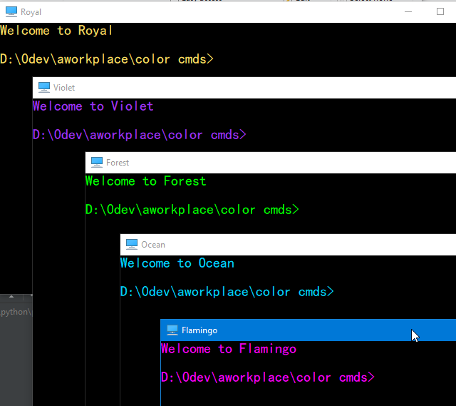

# Color Wheel

The following pictures are sourced from:
- https://drawpaintacademy.com/artists-color-wheel/
- https://www.invisionapp.com/inside-design/understanding-color-theory-the-color-wheel-and-finding-complementary-colors/
- http://changingminds.org/explanations/perception/visual/12-wheel.htm
- https://blog.asmartbear.com/color-wheels.html


8 colors with RGB, like 8-diagrams.

Here is the color wheel, more info [here](https://www.tigercolor.com/color-lab/color-theory/color-harmonies.htm)


We want to create color terminals.
Red and orange colors are kind of irritating, so we stay away from them.
We have 10 colors left on the wheel once we discard red and orange.
To make distinctions among colors, we choose the following colors:
- yellow
- green
- blue
- purple
- pink

Since we use them as font colors in command window/terminals, they should be
bright against black backgrounds.

[This site](https://graf1x.com/category/color-shades/) provides several shades.
It misses the purple shades.
[Wiki Web Color](https://en.wikipedia.org/wiki/Web_colors) and
[HTML color codes and names](https://www.computerhope.com/htmcolor.htm#color-codes)
provides extra color spectrum.
[Colors HEX](https://www.w3schools.com/colors/colors_hexadecimal.asp) can be used
to check colors.

For each color, we provide 3 options (see end). My favorites are:

| Color  |   Color Name   |  Hex   |     RGB     | 
|--------|----------------|--------|-------------| 
| Yellow | Royal          | FADA5E | 250 218 94  | 
| Green  | Lime           | 00FF00 | 0   255 0   | 
| Blue   | Azure+         | 00D0FF | 0   208 255 | 
| Purple | Jasmine Purple | A23BEC | 162 59  236 | 
| Pink   | Fuchsia        | FF00FF | 255 0   255 | 

Next we use these colors to create colorful command line windows. Don't know
how to do it in the 
[new terminal](https://www.howtogeek.com/673729/heres-why-the-new-windows-10-terminal-is-amazing/)
or Mac.

Now create a royal.bat somewhere with the following content
```
@echo off
cmd /k echo Welcome to Royal
@echo on
```
Then right mouse click and select "Create shortcut". Right mouse click on the
shortcut, in the color tab we can set the royal RGB. Here is the result:


In order to pin this to the Windows 10 menu, copy this shortcut to 
%AppData%\Microsoft\Windows\Start Menu\Programs
which is <user home>\AppData\Roaming\Microsoft\Windows\Start Menu\Programs.
User home is usually C:\Users\<login id>

I got all colorful terminals:


They show up like this:



Besides colors, we set the following as well. 

Set buffer size to 999 so we have more history.


Set Screen buffer size to 9999, set the window size 120 X 40.


By the way, [here](https://www.techrepublic.com/blog/windows-and-office/quick-tip-add-fonts-to-the-command-prompt/)
is the way to add a new font to the console. I personally don't bother to try it.


Finally, this is the full list of shades:


