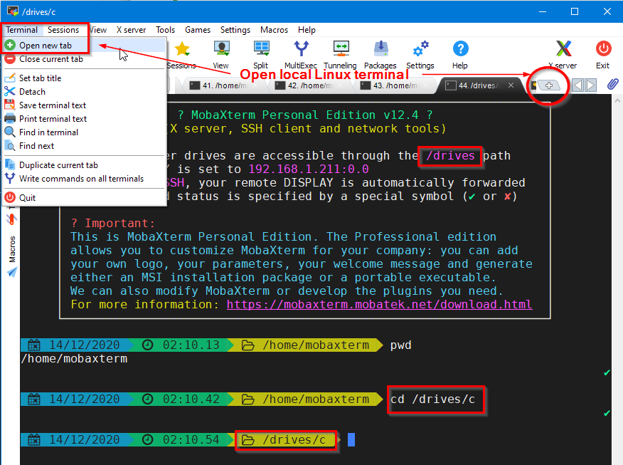
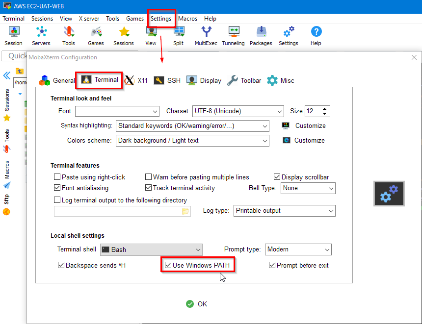
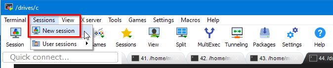
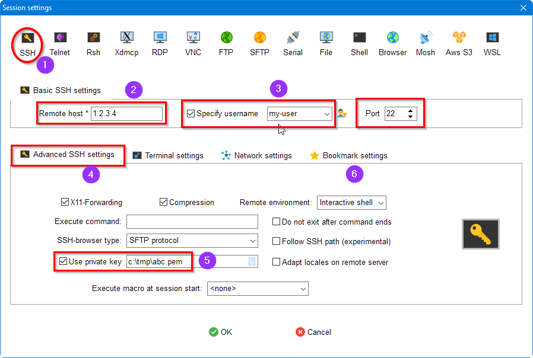
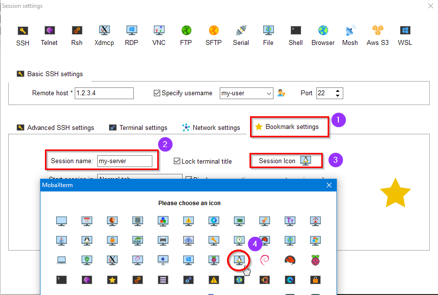
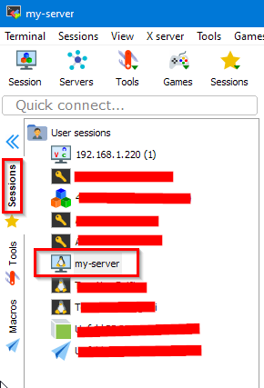

# MobaXterm Tips

MobaXterm's help page is [here](https://mobaxterm.mobatek.net/documentation.html#1). 
There is also a Feature page. This document is an introduction.

## Local Linux Terminals

There are 2 ways to launch local Linux terminals:

Local C:\ drive is mapped to /drives/c. We may change configurations from menu 
Settings | Configuration, such as fonts, colors, or add windows PATH to run
windows commands

# Remote SSH session

To start a remote SSH session, go to menu Sessions | New Session

Now we need to fill the info for the remote server

The default SSH port is 22, so we leave it alone. Now go to Advanced SSH 
settings. We need to provide the private key file.

Next we use the server name to name this session in the Bookmark settings.

We may choose a favorite icon for the session. After clicking OK at the bottom,
the new session should appear on the right:

We may create subgroups in user sessions for better management.
