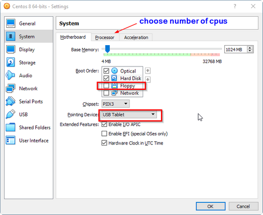
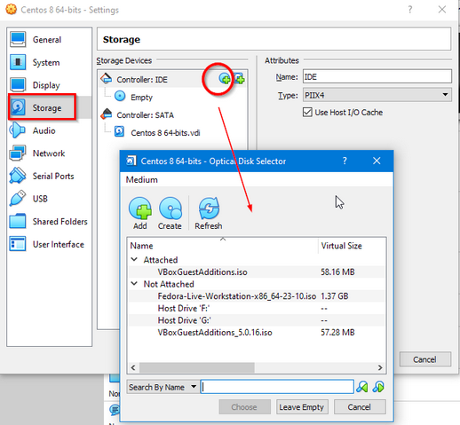

# Oracle VirtualBox Installation and Configuration

This is to host a Linux OS on windows. There are several options for PC virtualization:
- VirtualBox: https://www.virtualbox.org/
- VMWare Player: https://www.vmware.com/products/player
- MS Virtual PC: https://www.microsoft.com/en-us/download/details.aspx?id=4580

We are going to use VirtualBox.

## Installation
- Go to [virtualbox.org](https://www.virtualbox.org/wiki/Downloads) or
  [Oracle](https://www.oracle.com/virtualization/technologies/vm/downloads/virtualbox-downloads.html)
  and download windows package for windows hosts: 
  https://download.virtualbox.org/virtualbox/6.1.16/VirtualBox-6.1.16-140961-Win.exe.
- On the same web page, download extension pack. Click the "All supported platforms"
  in the Oracle VM VirtualBox Extension Pack section.
- Install VirtualBox.
- Install extension pack. You may need to turn off antivirus first because you
  run into error - "can’t rename directory".
- Launch virtualbox and check the extension pack from menu File | Preference | Extensions


## Install Linux OS Using OVA Appliance
- Download OS image from the following or elsewhere:
  - https://www.linuxvmimages.com/images/centos-8/, this is an .ova appliance.
  - https://www.centos.org/download/, this is ISO image.  
  
  You may choose other Linux flavors.
- In virtualbox, import the .ova file


  Now we should see the entry on the right.
- Configuration: click on the entry on the right, then click on the settings on the top.


- allow clipboard to copy between Linux and windows


- Set mouse to USB and assign number of CPUs



- Maxmize the display memory


- Set up network card


- set up audio


- set up shared folder between Linux and windows


  Then we need to run  
  ```sudo usermod -aG vboxsf $USER```
  and then reboot.
  
## Install Linux OS using ISO images
- In virtualbox, click New at the top to create a new virtual machine


- Then we need to create the virtual hard drive


- Then we need to load the image during configuration




## System Sanity Check
- internet connection is up.
- how to access ports from Linux to windows and vise vesa.
- can read/write to the shared folder on both OS.

