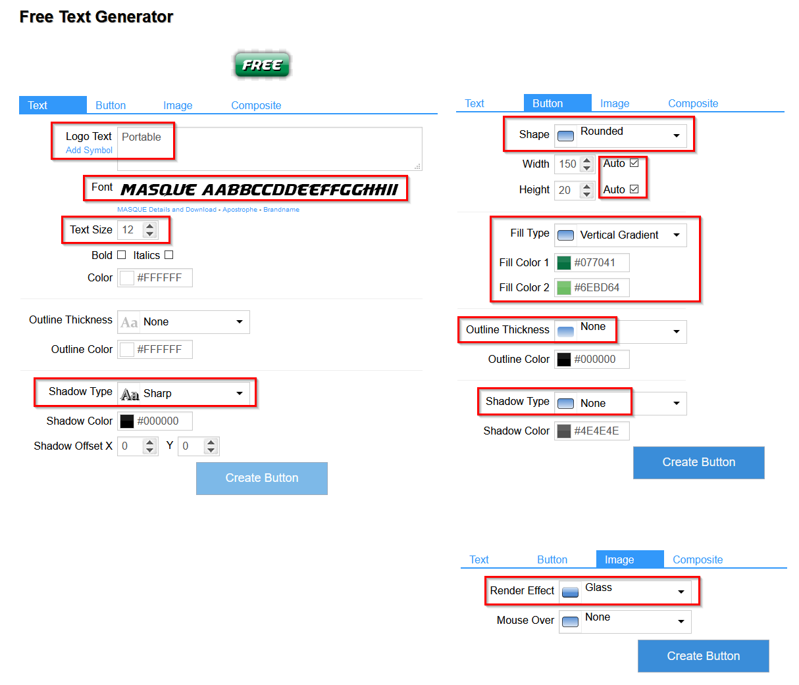

# Windows Tools
A set of commonly used tools. If one is not portable, either because there is 
no portable package or there is a tight integration for convenince, such as
windows shell integration.

## Disk Tools
- Disk clone: [Macrium Reflect](https://www.macrium.com/reflectfree)
  
- Disk partition: [Paragon](https://www.paragon-software.com/free/pm-express/#)
  
- Disk undelete: [Recuva](https://www.ccleaner.com/recuva)
  
- Burn images to USB: 
  [Rawrite32](https://www.netbsd.org/~martin/rawrite32/),
  [Rufus](https://rufus.ie/)
   
  
## Network and Communication
- Browsers: Chrome, FireFox, Opera  
  Turn on [topsites](browser/browser_setting.md) on browsers, so we have sites that we
  visit on a daily base. This is different from browser history.  
  Add markdown viewer extension to Chrome.
- Meetings: Zoom, VooV Meeting, Wechat
- FTP: [WinSCP](https://winscp.net/eng/index.php) 
   
- [qBittorrent](https://www.qbittorrent.org/)

## Basic Utilities
- System monitor: [HWiNFO](https://www.hwinfo.com/download/),
  [cpu-z](https://www.cpuid.com/softwares/cpu-z.html), both 
   
  though windows has System Information(search msinfo32).
  System Model in msinfo32 shows the model number and System Manufacturer
  shows the vendor. For example, model is XPS 8920 and vendor is DELL.
- Antivirus: [AVG Antivirus](https://www.avg.com/en-us/free-antivirus-download)
  
- Zip: [7-Zip](https://www.7-zip.org/)
  .
  Windows 10 has tar command line built in.
- File indexer/searcher: [Launchy](https://www.launchy.net/), 
  search files by file names.   
  Others are
  [Everything](https://www.voidtools.com/),
  [Wox](https://github.com/Wox-launcher/Wox),
  [Hain](https://github.com/hainproject/hain),
  [Listary](https://www.listary.com/),
  [Executor](http://executor.dk/).
- Editors: [Notepad++](https://notepad-plus-plus.org/), slow down with file 
  size > 500 MB.
  [EditPad Lite](https://www.editpadlite.com/) can handle large files.
    
  Other commercial tools, such as TextPad, UltraEdit, or
  Sublime Text.
- VirtualBox to install Linux/Mac.
- [Rainmeter](https://www.rainmeter.net/) is a desktop customization.
- [WinDirStat](https://windirstat.net/)

  
## Graphics and Multi-media
- Screen color picker: [ColorPic](http://www.iconico.com/colorpic/) 
  
- Screen capture: [Greenshot](https://getgreenshot.org/) 
   
  and [ShareX](https://getsharex.com/)   
  See [this](https://screenrec.com/screenshot-tool/best-free-screenshot-software/)
  for others.
- Screen GIF recording: [ScreenToGif](https://www.screentogif.com/)
      
  See [this](https://www.acethinker.com/desktop-recorder/gif-screen-recorder.html)
  for others.
- Screen video recording: [OBS Studio](https://obsproject.com/) and 
  [screenrec](https://screenrec.com/screen-recorder/). 
        
  See [this](https://screenrec.com/screen-recorder/best-free-screen-recording-software/),
  [this](https://www.techradar.com/news/the-best-free-screen-recorder),
  and [this](https://www.makeuseof.com/tag/record-desktop-12-great-screencasting-apps/)
  for others.
- Image viewer: [FastStone Image Viewer](https://www.faststone.org/download.htm)
   
- Video players: [VLC](https://www.videolan.org/) and 
  [KMPlayer](http://en.kmplayer.com/). 
- [Afterburner](https://www.msi.com/Landing/afterburner/graphics-cards)
- Digital pen: GAOMON S620  
- Text-To-Speech:
  [Balabolka](http://www.cross-plus-a.com/balabolka.htm)
     
  Other online tools: 
  [Natural Readers](https://www.naturalreaders.com/online/) is a simple text speaker.
  [Amazon Polly](https://aws.amazon.com/polly/) is not free. See more 
  [here](https://listoffreeware.com/list-of-best-free-text-to-speech-software/).
- Speech-To-Text:
  Windows 10 has built-in, search speech recognition in control panel.
  [SpeechNotes](https://speechnotes.co/) is an online tool(follow below Google 
  Docs instruction to turn on mic).
  [Amazon Transcribe](https://aws.amazon.com/transcribe/) is not free. There are mobile
  apps for this too. See more [here](https://zapier.com/blog/best-text-dictation-software/).
  
  [Google Docs](https://docs.google.com/document) has voice typing with Chrome
    - go to settings (upper right corner 3 dots).
    - click privacy and security on the right, then site settings on the right.
    - click microphone, turn on "Ask before accessing".
    - open a new doc, go to Tools menu and select voice typing.
    - click the microphone icon and start dictation.
- Windows subsystem Linux 2

## Documents
- Notes: [OneNote](https://www.onenote.com/download) and GitHub.   
  [Here](one_notes/one_notes.md) are more tips.  
  There are many other options, including cloud based apps.
- Mind Mapping: [XMind](https://www.xmind.net/) . 
  See [this](https://thedigitalprojectmanager.com/mind-mapping-software/) and
  [this](https://zapier.com/blog/best-mind-mapping-software/) for others.
- Diagrams: [draw.io for Windows](https://www.draw.io)  and MS Visio.
- PDF viewers: Chrome, [Sumatra PDF](https://www.sumatrapdfreader.org/free-pdf-reader.html).
    
  Others are Adobe Reader, Foxit. Sumatra can read other formats, such as ePub, Mobi, djvu. 
  
  [PDFill](http://www.pdfill.com/) for form filling. 
- E-Book reader: No extra software needed.
  WinDjview/MacDjView can be replaced by Sumatra.
  Unicorn Viewer supports PDF, PDG, djvu, but seems out of date.
- Document content indexer: [DocFetcher](http://docfetcher.sourceforge.net/en/index.html)
  and [AnyTXT](https://anytxt.net/). 
- [Typora](https://typora.io/) is a MarkDown editor.
- Document scanner: OCR

The icons are generated from: 
https://cooltext.com/Edit-Logo?LogoID=3713219011&3713219011_Font=899
With the following settings:

