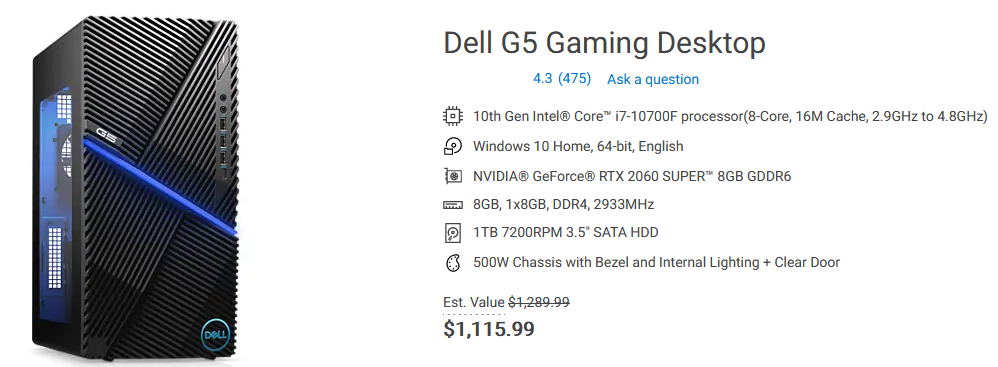
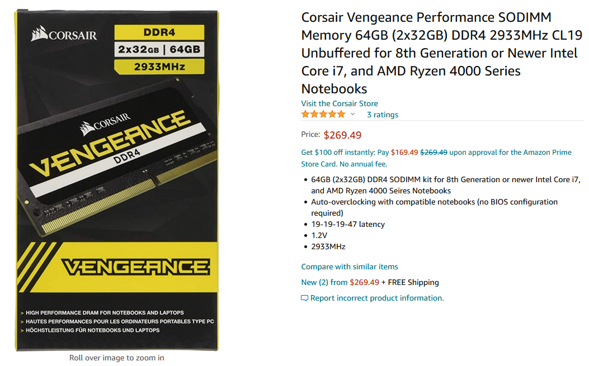
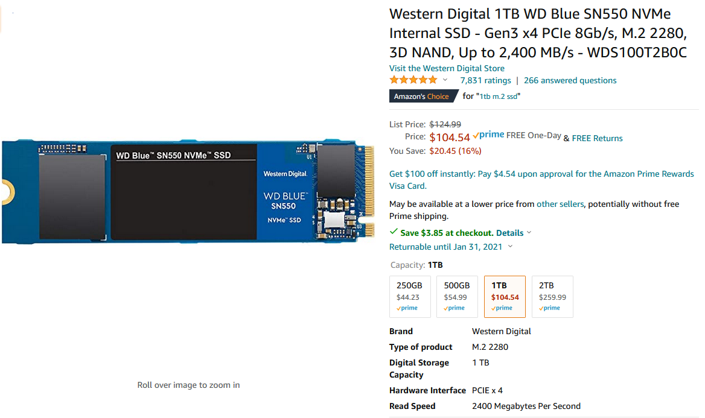

# 2020 Computer

Need a computer for programming (including Deep Learning Training on GPU) and 
non real time gaming occasionally. So this is not a gaming machine, but not 
far from it.

## Baseline
Don't have time for DIY, so shop around on the market.
[Dell Gaming Desktop](https://www.dell.com/en-us/member/shop/desktop-computers/dell-g5-gaming-desktop/spd/g-series-5000-desktop/gd5090g520s?configurationid=150ca83c-51ce-40ff-8103-0959f2d012a2)
is close to what we need:

Another choice is Dell XPS Desktop.
[html](2020_Dell-G5-Gaming-Desktop_2020-12-09.html)
has the detail. This configuration takes care of CPU, GPU and PSU. We need to 
upgrade the memory and hard drive.

CPU is $310, but it's hard to get a fair price on GPU. It seems that GPU is in 
high demanding now. Covid-19 plays a role too.

## Upgrades

Here are the prices for memory and hard drive:

